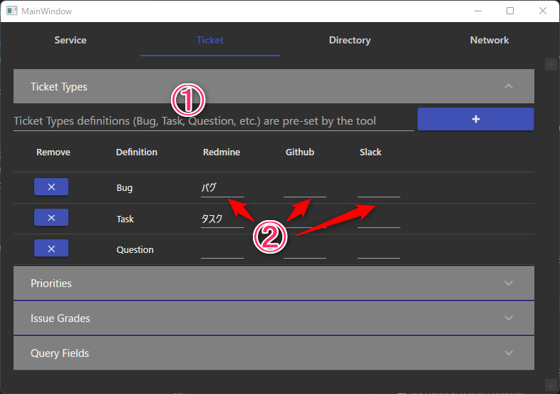

# How to set Config

You have to create "Project Config" for using BocchiTracker after please share the config to your project members.

The following is the procedure for creating a configuration file:

1. Run BocchiTracker.Client.exe
2. Decide whichi one to edit config or create new config after click "OK"
    - To edit a config, select the config to edit in the drop-down.
    - To create a config, enter the config name directly.

## Authentication(Require)

You have to set Authentication for creating ticket. Each service requires a different input setup

To check authentication, click "Check Authentication". If it turns green, it was successful.

### Redmine

1. Please check "Enable REST web service" on the manager of redmine
2. Input parameter in the Redmine Settings tab of the Config tool
    - URL: Input URL that include project name (ex:http://localhost:3000/projects/bocchitracker)
    - If ProxyURL is required, please enter that information as well.
    - Username and Password: Input Registered of redmine account.

### Github

1. [Please create Github token](https://github.com/settings/tokens)
2. Input parameter in the Redmine Github tab of the Config tool
    - URL: Input repository of URL(ex:https://github.com/KirisameMarisa/BocchiTracker)
    - Input the Token got in 1.

### Slack

1. [Create Slack application](https://api.slack.com/apps) and need to give authority
    - chat:write
    - files:write
    - users:read
    - Enable socket mode and get token
2. Join your slack workspace and add your channel that you want to post.
3. Input parameter in the Slack Settings tab of the Config tool
    - URL: Input joined channel name
    - Enter the Token got in 1.

## Ticket setting(Optional)

This feature is intended to properly associate the ticket information used for each service with the name of the definition used in the tool. For example, an item such as "Priority" may have a different name for different services, such as "Low" or "Low".

This setting is optional, not mandatory. However, it does allow you to provide more detailed information when submitting tickets.

Adding a defined name in the tool (1):  
Use this input field to add a specific name to be used within the tool. For example, if you have a special name that is unique to your project, add it here.

Associate each service (2):  
Associate the name used by each service with the name in the tool. For each service, enter the name of an item such as ticket category or priority.
The sample image shows an example of entering a ticket category for "Redmine".

## Directory Setting(Optional)

In this section, you can configure the following settings

(1) Specify the directory where screenshots and core dumps are saved
Specify the directory where files are saved when the application obtains screenshots or core dumps.

(2) Designation of where information is saved for each service
Specify the directory where information used by different services, e.g., user names, label lists, etc., will be saved.
If not specified, it is automatically created in the TEMP directory.

#### Monitored Directory Config

This section allows you to configure settings to monitor specific directories and automatically add them to the file upload list when new files are created.

(3) Specify the directory to be monitored: 
Specify the path of the directory to be monitored.

(4) Specify filters: 
Specify the filter to be used to search for files. File search character of [C#::GetFiles](https://learn.microsoft.com/ja-jp/dotnet/api/system.io.directory.getfiles?view=net-7.0#system-io-directory-getfiles(system-string-system-string-system-io-searchoption))

#### (5) External tool Path

By specifying the path to an external tool, you can access the functionality of the following tools

##### Procdump

Specify this application path to get a core dump of your Windows application

## Network Setting(任意)

In Progress...