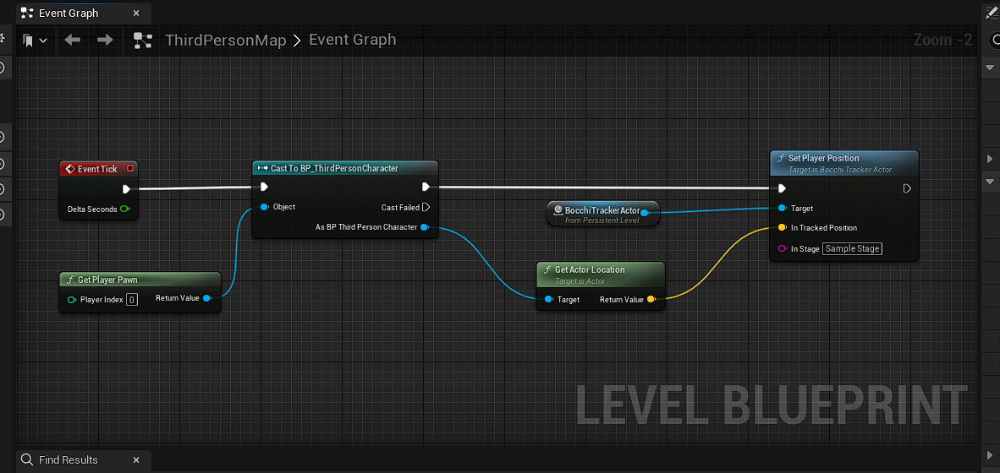

# Installing Unreal Engine Plugin

## Prerequisites

First, follow these steps to build flatbuffers:

1. Run `python ExternalTools\BuildScripts\build_flatbuffers.py`.

2. After the build is complete, make sure the files are located in the following directories:
   - `Plugins\UnrealEngine\ThirdParty\flatbuffers\include`
   - `Plugins\UnrealEngine\ThirdParty\flatbuffers\lib`

## Placing the Unreal Engine Plugin

Let's install the BocchiTracker plugin in your Unreal Engine project:

1. Copy the `Plugins\UnrealEngine\BocchiTracker` directory to `[Project Root]/Plugins/BocchiTracker`.

2. Also, copy the `Plugins\UnrealEngine\ThirdParty\flatbuffers` directory to `[Project Root]/Source/ThirdParty/flatbuffers`.

The BocchiTracker plugin has now been properly placed. For more detailed steps, refer to the [UE plugin documentation](https://docs.unrealengine.com/4.27/en/ProductionPipelines/Plugins/).

Once the installation is complete, please ensure that the build runs successfully.

## Using the BocchiTracker Plugin

To make use of the BocchiTracker plugin, follow these steps:

1. Place a BocchiTrackerActor in your Scene. This will automatically establish a connection with the tool.
   

2. If you want to send player position information, it needs to be integrated into Blueprints.
   

# Installing Unity Plugin

## Installing the Unity Plugin

Here's how you can install the BocchiTracker plugin in your Unity project.

### Directly from Github

1. In Unity's menu, select `Window > Package Manager`.

2. Click the `+` icon and choose `Add package from git URL`.

3. Enter the following URL:
   > https://github.com/KirisameMarisa/BocchiTracker?path=Plugins/Unity/Artifact

4. ※ Note: Google FlatBuffers DLL is required. Please install it separately in Unity.

### Installing from a Cloned BocchiTracker for Local Installation

First, follow these steps to build flatbuffers:

1. Run `python ExternalTools\BuildScripts\build_flatbuffers.py`.

2. After the build is complete, make sure the files are located in the following directories:
   - `Plugins\Unity\Artifact\BocchiTracker.dll`
   - `Plugins\Unity\Artifact\package.json`
   - `Plugins\Unity\Artifact\Google.FlatBuffers.dll`

3. In Unity's menu, select `Window > Package Manager`.

4. Click the `+` icon and choose `Add package from disk...`.

5. Select the `Plugins\Unity\Artifact\package.json` file for installation.

Now the BocchiTracker plugin is properly installed.

## Using the BocchiTracker Plugin

To make use of the BocchiTracker plugin, follow these steps:

1. Create a GameObject and add the `BocchiTrackerSystem.cs` and `BocchiTrackerSetting.cs` components to it.
   This will enable the connection with the tool.
   

2. If you want to send player position information, add the component and configure it accordingly.
   - `Distance Threshold`: Set the value for how much the player's position needs to change before sending coordinates to the tool.
   