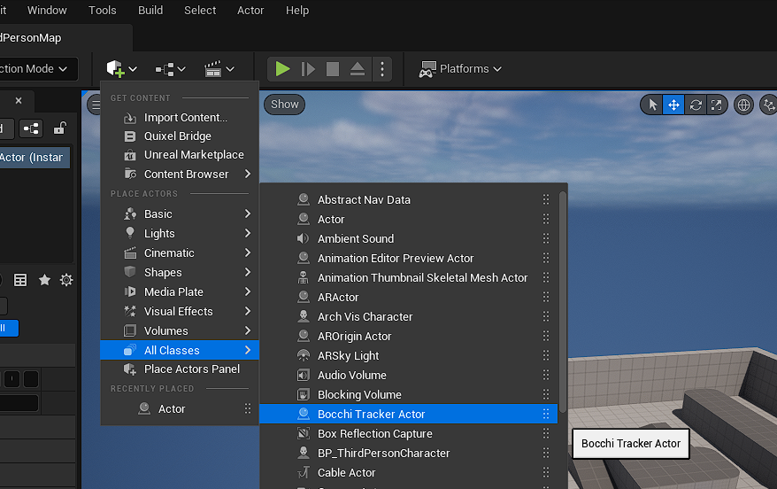

# Unreal Engine Pluginのインストール方法

## 前準備

まずは以下の手順で、flatbuffersのビルドを行ってください。

1. `python ExternalTools\BuildScripts\build_flatbuffers.py` を実行します。

2. ビルドが完了したら、以下のディレクトリにファイルが配置されていることを確認してください。
   - `Plugins\UnrealEngine\ThirdParty\flatbuffers\include`
   - `Plugins\UnrealEngine\ThirdParty\flatbuffers\lib`

## Unreal Engine Pluginの配置

BocchiTrackerプラグインをプロジェクトにインストールしましょう。

1. `Plugins\UnrealEngine\BocchiTracker` ディレクトリを `[Project Root]/Plugins/BocchiTracker` にコピーします。

2. また、`Plugins\UnrealEngine\ThirdParty\flatbuffers` ディレクトリを `[Project Root]/Source/ThirdParty/flatbuffers` にコピーします。

これでBocchiTrackerプラグインが正しく配置されました。詳細な手順については、[UEのプラグインドキュメント](https://docs.unrealengine.com/4.27/ja/ProductionPipelines/Plugins/)も参考にしてください。

インストールが完了したら、ビルドが正常に行われるか確認してください。

## BocchiTrackerプラグインの使用方法

BocchiTrackerプラグインを有効にして、以下の手順に従って使用します。

1. BocchiTrackerActorをSceneに配置します。これにより、ツールとの連携が自動的に行われます。
   

2. プレイヤーの位置情報を送信したい場合、BluePrintへの組み込みが必要です。
   

# Unity Pluginのインストール方法

## Unity Pluginのインストール

BocchiTrackerプラグインをUnityプロジェクトにインストールする方法を以下に示します。

### Githubから直接の場合

1. Unityのメニューから `Window > Package Manager` を選択します。

2. `+` アイコンをクリックし、`Add package from git URL` を選択します。

3. 以下のURLを入力します。
   > https://github.com/KirisameMarisa/BocchiTracker?path=Plugins/Unity/Artifact

4. ※ 注意：Google FlatBuffersのDLLが必要です。別途Unityへインストールしてください。

### BocchiTrackerをCloneしてLocalインストールする場合

まずは以下の手順で、flatbuffersのビルドを行ってください。

1. `python ExternalTools\BuildScripts\build_flatbuffers.py` を実行します。

2. ビルドが完了したら、以下のディレクトリにファイルが配置されていることを確認してください。
   - `Plugins\Unity\Artifact\BocchiTracker.dll`
   - `Plugins\Unity\Artifact\package.json`
   - `Plugins\Unity\Artifact\Google.FlatBuffers.dll`

3. Unityのメニューから `Window > Package Manager` を選択します。

4. `+` アイコンをクリックし、`Add package from disk...` を選択します。

5. `Plugins\Unity\Artifact\package.json` ファイルを選択してインストールします。

これでBocchiTrackerプラグインが正しくインストールされました。

## BocchiTrackerプラグインの使用方法

BocchiTrackerプラグインを有効にして、以下の手順に従って使用します。

1. GameObjectを作成し、`BocchiTrackerSystem.cs` と `BocchiTrackerSetting.cs` コンポーネントを追加します。
   これにより、ツールとの接続が有効になります。
   

2. プレイヤーの座標を送信したい場合は、コンポーネントを追加し、適切な設定を行います。
   - `Distance Threshold`: プレイヤーの座標がどれだけ変わったら、ツールへ座標を送信するかを設定します。
   