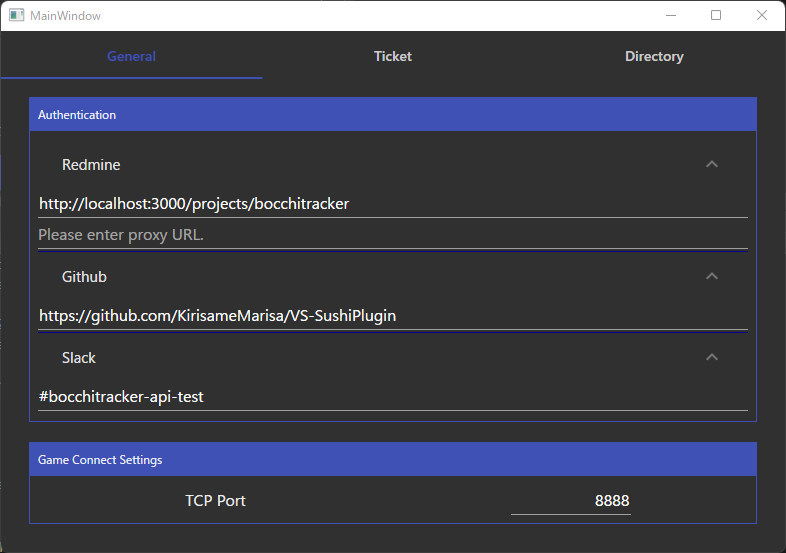
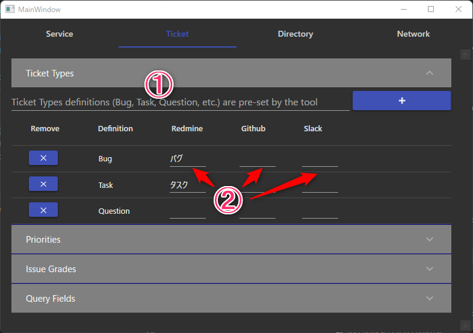
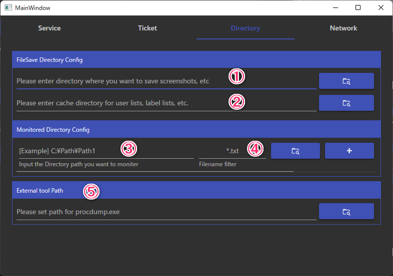

# ProjectConfig設定

BocchiTrackerを使用するためには、プロジェクトの設定ファイル（Config）を作成する必要があります。 
作成したConfigは、プロジェクトに参加しているユーザーに配布してください。

以下は設定ファイルの作成手順です：

1. BocchiTracker.Client.exeを起動してください。
2. 既存のConfigを編集するか、新規にConfigファイルを作成するかを選択し、OKボタンを押します。
    - 既存のConfigを編集する場合は、リストから編集したいConfigを選択してください。
    - 新規のConfigを作成する場合は、直接名前を入力してください。

## レポート発行サービスのURL設定(必須)

チケット作成のために、それぞれのサービスへの認証設定が必要です。

### Redmine

1. Redmineの管理画面から「RESTによるWebサービスを有効にする」にチェックを入れてください
2. ConfigツールのRedmine設定タブに以下のパラメータを入力します。
    - Proxyが必要な場合は、その情報も入力します
    - URL: プロジェクトを含んだURLを入力します（例：http://localhost:3000/projects/bocchitracker）

### Github

1. ConfigツールのGithub設定タブに以下のパラメータを入力します。
    - URL: リポジトリのURLを入力します（例：https://github.com/KirisameMarisa/BocchiTracker)
    
### Slack

1. [Slackアプリを作成](https://api.slack.com/apps)します。必要な権限を与えます。
    - chat:write
    - files:write
    - users:read
    - Socket Modeを有効にし、Tokenを取得します。
2. 作成したSlackアプリをSlackワークスペースに追加し、投稿したいチャンネルに招待します。
3. ConfigツールのSlack設定タブに以下のパラメータを入力します。
    - URL: 招待したチャンネルを入力します（例：#bocchitracker-api-test)

## ゲーム通信ポート(任意)

組み込んだプラグインと通信ポート番号を合わせてください。 
デフォルトは「8888」です

## チケット設定(任意)

この機能は、各サービスで使用されるチケットの情報と、ツール内で使用される定義名を適切に関連付けるためのものです。例えば、"Priority"（優先度）といった項目は、異なるサービスごとに"低"や"Low"などの異なる名前で表されることがあります。

この設定は、必須ではなく、任意の設定です。しかし、設定することでチケットの投稿時により詳細な情報を提供できるようになります。

ツールでの定義名追加 (①):  
この入力欄を使用して、ツール内で使用する特定の名前を追加できます。例えば、あなたのプロジェクトで独自に使用する特別な名前がある場合、ここに追加します。

サービスごとの関連付け (②):  
各サービスが使用する名前とツール内での名前を関連付けます。サービスごとに、チケットのカテゴリや優先度といった項目の名前を入力してください。サンプル画像では、Redmineのチケットカテゴリを入力する例が示されています。

## ディレクトリ設定(任意)

#### FileSave Directory Config

このセクションでは、以下の設定が行えます。

① スクリーンショットやコアダンプの保存ディレクトリの指定: 
アプリケーションがスクリーンショットやコアダンプを取得した際のファイル保存ディレクトリを指定します。

② 各サービスの情報保存場所の指定: 
異なるサービスで使用される情報、例えばユーザー名やラベルリストなど、を保存するディレクトリを指定します。
指定しない場合は、TEMPディレクトリに自動的に作成されます。

#### Monitored Directory Config

このセクションでは、特定のディレクトリを監視し、新しいファイルが作成された場合に自動的にファイルアップロードリストに追加する設定が行えます。

③ 監視対象ディレクトリの指定: 
監視したいディレクトリのパスを指定します。

④ フィルターの指定: 
ファイルの検索に使用するフィルターを指定します。[C#::GetFilesのファイル検索文字](https://learn.microsoft.com/ja-jp/dotnet/api/system.io.directory.getfiles?view=net-7.0#system-io-directory-getfiles(system-string-system-string-system-io-searchoption)) の書式で指定可能です。

#### ⑤External tool Path

外部ツールのパスを指定することで、以下のツールの機能を利用できます。

##### Procdump

このアプリケーションパスを指定することでWindowsアプリケーションのコアダンプの取得が可能になります

