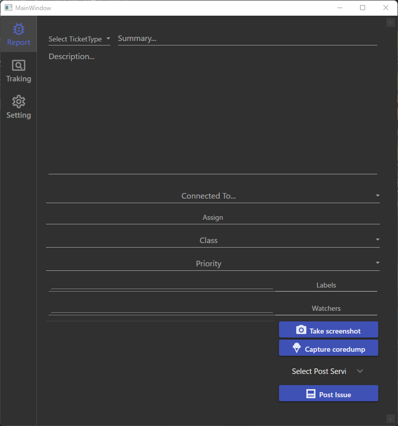

# What's this BocchiTracker?

BocchiTracker is a bug reporting tool that allows you to report issues to various services. 

 
BocchiTracker View!

 

Coordinates and other cumbersome inputs are automatically entered.
 
Screenshots can also be taken with the push of a button!

 
Currently supported game engine services include:

|Unity|UnrealEngine|Godot|
|:--:|:--:|:--:|
|◯|◯|◯|

 

 
Currently supported report services include:

|Redmine|Github|Slack|Discord|Gitlab|JIRA|
|:--:|:--:|:--:|:--:|:--:|:--:|
|◯|◯|◯|||||

 
Currently supported upload service include:

|Dropbox|Explorer|
|:--:|:--:|
|||

 

## Features

- It can be gathered application-specific information if you Integrate plugin with game/application.
- Custom fields for reporting services can be supported.
- Supports attaching screenshots and core dumps to the bug reports.
- Offers directory monitoring to ensure thorough ticket reporting.

## Feature Plans

- Add to feature file upload functionality.
  - Dropbox
  - Explorer (Your file servers)
- [Assist in traking issues](https://github.com/KirisameMarisa/BocchiTracker/milestone/2)

## Getting Started

1. [Download BocchiTracker](https://github.com/KirisameMarisa/BocchiTracker/releases)
2. Setup Config 
   - ProjectConfig - [JP](/Documents/JP/ProjectConfigurationGuide.md)/[EN](/Documents/EN/ProjectConfigurationGuide.md)
   - UserConfig - [JP](/Documents/JP/UserConfigurationGuide.md)/[EN](/Documents/EN/UserConfigurationGuide.md)

3. Integrat your project - [JP](/Documents/JP/IntegrateYourAppGuide.md)/[EN](/Documents/EN/IntegrateYourAppGuide.md)
4. Read UserGuide - [JP](/Documents/JP/UserGuide.md)/[EN](/Documents/EN/UserGuide.md)

## How to build?

#### BocchiTracker(WPF) Build

1. Run `dotnet build Application/BocchiTracker.WPF.sln`

#### flatbuffers Build

1. Run `python ExternalTools\BuildScripts\build_flatbuffers.py`

#### UE Build

※ Required flatbuffers build

1. Copy the `Plugins\UnrealEngine\BocchiTracker` directory to `[Project Root]/Plugins/BocchiTracker`.

2. Also, copy the `Plugins\UnrealEngine\ThirdParty\flatbuffers` directory to `[Project Root]/Source/ThirdParty/flatbuffers`.

#### Unity Build

※ Required flatbuffers build

1. Run `Plugins\Unity\ThirdParty\Unity\Setup.bat`
    - Enter directory path of Unity dll 
2. Run `dotnet build Plugins\Unity\BocchiTracker\BocchiTracker.sln`

## Problems? 

If you encounter any issues, have feature requests, or wish to provide feedback, please feel free to create issues

If you want to communicate a problem directly with me, you can join Discord. Please feel free to ask!

- Discord: [Join our Discord server](https://join.slack.com/t/bocchitracker/shared_invite/zt-20lzjarua-cmYTqEiBiCSFp_A1cq36Qg)

---

[License](LICENCE.txt)
